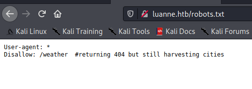
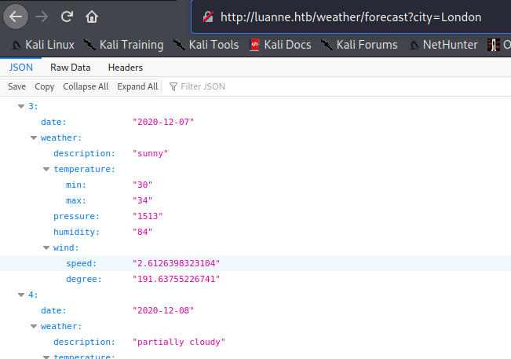

luanne

----
# Luanne HTB [ 10.10.10.218 ]

## Foothold

- Scan with rustscan to find out the open ports.
	` rustscan -b 500 -a luanne.htb -- -sV `
	
	|PORT   |STATE |SERVICE|REASON|VERSION |
	--------|------|-------|------|--------
	|22/tcp  | open | ssh   |  syn-ack |OpenSSH 8.0 (NetBSD 	20190418-hpn13v14-lpk; protocol 2.0)
	|80/tcp  | open | http   | syn-ack| nginx 1.19.0
	|9001/tcp| open | http    |syn-ack| Medusa httpd 1.12 	(Supervisor process manager)
- Check for the robots.txt file
	
- The /weather endpoint returned 404, fuzz further using ffuf.
	`ffuf -c -w /usr/share/wordlists/dirb/big.txt -u http://luanne.htb/weather/FUZZ -of md -o ffuf-big.md`
	
	The above command revealed the **/weather/forecast** endpoint.
	
- Accessing the endpoint returned a json output of the weather data for city queried.

	
	
- 
	